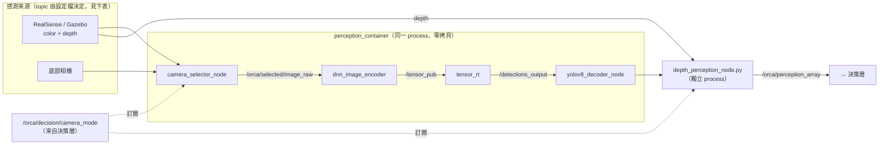
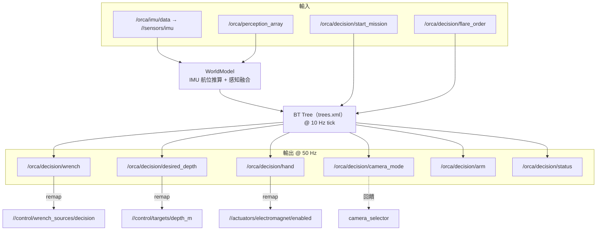

# 架構：感知與決策堆疊

SAUVC-JETSON 是跑在 **Jetson Orin NX + Isaac ROS 3.2** 上的自主系統：相機輸入 → 物件偵測 →
深度估計 → BehaviorTree 任務執行 → wrench 指令。

安裝與啟動見 [README.md](README.md)；本文件說明系統怎麼運作。
假設讀者具備 ROS 2 基礎（node / topic / QoS / composable node / launch）。

---

## 1. 分層與交界

```
感測                 感知                          決策                    控制
────                ────                         ────                   ────
RealSense D435  ─┐                                                     （SAUVC-RPI）
底部 USB 相機   ─┼→ camera_selector → YOLOv8 → depth_perception  →  decision_node  →  wrench_sources/decision
控制堆疊 IMU    ─┘                    (TensorRT)  /orca/perception_array  (BT.CPP v3)     targets/depth_m
                                                                                          actuators/electromagnet/enabled
```

| 層 | package | 角色 |
|---|---|---|
| 感知 | `camera_selector`、`isaac_ros_yolov8`、`depth_perception`、`orca_perception` | 影像 → 2D 偵測 → 3D 定位 |
| 決策 | `orca_decision` | BehaviorTree 任務執行、輸出控制指令 |
| 介面 | `orca_interface` | 兩層共用的自訂訊息 |

**不在此 repo**：推力分配與馬達控制，在 [SAUVC-RPI](../SAUVC-RPI/) 的控制堆疊。
交界只有三個 topic（見 §3.2 的 remap 表）。

### Namespace

決策層與感知層都由 `namespace` 參數推導，預設讀 `ORCA_NAMESPACE`（super-repo 的 `.env`）：

- `decision.launch.py` 以它組出 remap 目標
- `perception.launch.py` 展開 YAML 裡的 `$(ns)`

只有**來自載具**的話題跟著 namespace 走。管線內部的 `/orca/...` 不跟；
實機 RealSense driver 掛在固定的 `/orca` 前綴，也與載具 namespace 無關 ——
所以 `perception_params.yaml` 一個 `$(ns)` 都沒有，`simulation_params.yaml` 有六個。

---

## 2. 感知層

影像編碼、TensorRT 推論、YOLOv8 解碼三步共用同一塊 GPU 記憶體，放進同一個
composable node container（`perception_container`），走 NITROS 零拷貝傳張量。



### 2.1 輸入話題（實機 vs 模擬）

| 用途 | `perception_params.yaml`（實機） | `simulation_params.yaml`（模擬） |
|---|---|---|
| 前相機影像 | `/orca/color/image_raw` | `/$(ns)/color/image_raw` |
| 前相機 info | `/orca/color/camera_info` | `/$(ns)/color/camera_info` |
| 底部相機 | `/orca/usb_cam/image_raw` | `/$(ns)/camera/bottom/image_raw` |
| 深度影像 | `/orca/aligned_depth_to_color/image_raw` | `/$(ns)/depth/image_raw` |
| 深度 info | `/orca/color/camera_info` | `/$(ns)/depth/camera_info` |

兩份 YAML 的差異**只有**這五組話題與 `use_viz`，其餘（模型 profile、門檻、穩定度參數）完全相同。
選哪份由 `make` 的 `SIM` 推導。

### 2.2 逐 package

**`camera_selector`**（C++，composable）—— 依 mode 轉發影像來源並對齊時間戳。

| I/O | Topic | 型別 |
|---|---|---|
| Sub | 前相機、底部相機的 image + camera_info | `Image`、`CameraInfo` |
| Sub | `/orca/decision/camera_mode` | `String`（reliable + transient_local） |
| Pub | `/orca/selected/image_raw`、`/orca/selected/camera_info` | `Image`、`CameraInfo` |

**`isaac_ros_yolov8`**（改自 NVIDIA `isaac_ros_object_detection`）—— TensorRT 張量 → `Detection2DArray`。
輸出 `/detections_output`。自帶的獨立 launch 已 deprecated，一律透過 `orca_perception` 組裝。

**`depth_perception`**（Python）—— 感知到決策之間唯一的橋樑。2D 框 + 深度圖 → 3D 位置 + 多幀穩定度。

| I/O | Topic | 型別 |
|---|---|---|
| Sub | 深度影像、camera_info | `Image`（best-effort）、`CameraInfo` |
| Sub | `/detections_output` | `Detection2DArray`（reliable） |
| Sub | `/orca/decision/camera_mode` | `String`（transient_local） |
| Pub | `/orca/perception_array` | `orca_interface/PerceptionArray` |

兩種模式：
- **realsense**：閘門用左右對稱深度取樣，一般物件用中心裁切區的百分位數深度，解算 3D `pose`。
- **usb**：只做 2D passthrough（`distance = -1.0`、`valid = false`），穩定度追蹤仍運作。

**`orca_perception`**（統一 launcher，無自己的 node）——
建 container 放三個 composable node、attach dnn_image_encoder、獨立起 `depth_perception_node.py`
與可選的 viz。`model_profiles` 機制依 `model_profile` 參數切換 `.onnx` 與類別數。

啟動：`ros2 launch orca_perception perception.launch.py`

---

## 3. 決策層

用 **BehaviorTree.CPP v3** 而非手刻 FSM：子樹可重用、Fallback 天生支援失敗退回、
任務流程寫在 `config/trees.xml` 換賽制不用重編譯。

### 3.1 資料流



### 3.2 跨堆疊 remap（`decision.launch.py`）

| 內部話題 | remap 目標 | 用途 |
|---|---|---|
| `/orca/imu/data` | `/<ns>/sensors/imu` | 姿態來源。少了它世界模型永遠停在建構姿態 |
| `/orca/decision/wrench` | `/<ns>/control/wrench_sources/decision` | 運動指令上匯流排 |
| `/orca/decision/desired_depth` | `/<ns>/control/targets/depth_m` | 深度設定點 |
| `/orca/decision/hand` | `/<ns>/actuators/electromagnet/enabled` | 抓球電磁鐵，STM32 韌體經 micro-ROS 接收 |

> `/orca/decision/arm`（`ExtendArm` / `RetractArm`）**沒有 remap** ——
> 控制堆疊根本沒有手臂致動話題，那兩個節點目前是空操作。

### 3.3 核心元件

| 元件 | 職責 |
|---|---|
| `DecisionContext` | BT 節點共享的 blackboard：任務狀態、目標標籤、publisher |
| `WorldModel` | IMU 航位推算 + 感知融合，維護 `TrackedObject`；逾時的物件會被剔除 |
| `WrenchAdapter` | `MotionCommand`（surge/sway/heave/yaw）→ 低通濾波後的 `Wrench` |

### 3.4 BT 節點與任務樹

`src/behavior_tree_nodes/` 有 22 個自訂節點：搜尋（`SearchTarget`、`SearchBottomTarget`、
`SpiralSearchBottom`）、逼近（`ApproachTarget`、`FinalAlignTarget`、`MoveAboveTarget`、
`GoToPose`）、避障（`AvoidObstacle`）、致動（`ExtendArm`、`GrabBall`、`RetractArm`、`DropBall`）、
姿態（`SetDepth`、`TurnToYaw`、`BlindForward`、`BumpFlare`）等。
非同步行為靠 BT tick loop 加內部逾時管理，**沒有用 ROS 2 action server**。

`config/trees.xml` 的五棵樹：

| 樹 | 內容 |
|---|---|
| `FinalMission` | 主樹。過閘門 → 投球 → 二次過閘門 → 通訊旗語 → 取球 → 結束 |
| `QualificationMission` | 潛水 → 過閘門 → 迴轉 → 回程 → 浮出 |
| `PassGateProcedure` | 子樹：搜尋 → 逼近 → 對正 → 盲進。三處引用 |
| `TargetAcquisition` | 子樹：搜尋藍桶 → 逼近 → 切底部相機 → 置中 → 投球 → 確認淨空 |
| `TargetReacquisition` | 子樹：回到投球位置 → 找球 → 取球 |

任務由 `/orca/decision/start_mission` 觸發（`wait_for_start.cpp` 這個節點存在但樹裡沒用到）。

**共用子樹的深度是呼叫端的責任。** `SetDepth` 是 SyncActionNode，發一次就返回、沒有還原，
所以子樹裡不能寫死深度 —— 會蓋掉呼叫端剛設好的值。

啟動：`ros2 launch orca_decision autonomy.launch.py` —— 同時拉起感知管線與決策節點。

> **不要只跑 `decision.launch.py`。** 它只有行為樹，沒有任何節點發布
> `/orca/perception_array`，世界模型永遠是空的：所有搜尋／逼近節點跑到逾時，
> 而 `ros2 node list` 與 `make status` 全都顯示健康。
> 它只給「單獨除錯行為樹」用（等同 `autonomy.launch.py use_perception:=false`）。

---

## 4. 訊息介面：`orca_interface`

兩層之間唯一的自訂訊息，無 node。

**`PerceptionArray.msg`** = `std_msgs/Header header` + `PerceptionObject[] objects`

`header.stamp` 沿用觸發推論的影像幀時間戳；`objects` 可能是空陣列。

**`PerceptionObject.msg`**

| 欄位 | 型別 | 語意 |
|---|---|---|
| `label` | `string` | 由 `class_id` 查 `class_names` 反查 |
| `confidence` | `float32` | YOLO 原始信心分數 `[0, 1]` |
| `cx`、`cy`、`width`、`height` | `float32` | 2D bbox。**座標系是送進網路前的 640×640 張量空間**，不是原始相機解析度。中心是 (320, 320) |
| `pose` | `geometry_msgs/Pose` | 相對 AUV 的 3D 位置，公尺，相機座標系（X 右、Y 下、Z 前）。**只有 realsense 模式有效**。`orientation` 恆為單位四元數，不表示物件朝向 |
| `distance` | `float32` | 距離（公尺）。usb 模式或深度不合理時為 `-1.0` |
| `valid` | `bool` | **單幀**深度合理性 |
| `is_stable` | `bool` | **多幀**穩定度：命中次數、位置標準差、信心三個門檻同時滿足 |

`valid` 篩掉「這一幀深度壞掉」，`is_stable` 篩掉「目標時有時無、位置跳動」。
決策層的 `WorldModel` 主要依賴後者。

**`DecisionStatus.msg`**：`header`、`mission_phase`、`current_action`、`target_label`、
`target_position`、`target_locked`、`is_recovering`、`mission_time`、`camera_mode`、`debug`

---

## 5. 設定與模型

| 檔案 | 內容 |
|---|---|
| `perception_pipeline/orca_perception/config/perception_params.yaml` | 感知管線（實機） |
| `perception_pipeline/orca_perception/config/simulation_params.yaml` | 感知管線（模擬） |
| `orca_decision/config/decision_params.yaml` | 決策參數 |
| `orca_decision/config/trees.xml` | 任務樹 |

`decision_params.yaml` 的 `image_center_x` / `image_center_y`（320 / 320）是偵測影像中心的
**單一來源**，四個 BT 節點都讀它。不要在節點裡另外寫常數。

### `model/`

| 檔案 | profile | 類別數 | 狀態 |
|---|---|---|---|
| `finals.onnx` | `finals`（預設） | 7 | 決賽用。**模擬也用這個** |
| `qualification.onnx` | `qualification` | 1 | 資格賽，只偵測 `gate` |
| `sim_best.onnx` | — | 7 | **不要用。** 輸出形狀與 `finals.onnx` 相同可直接替換，但辨識率很低、會把泳池底部格線判成 gate |
| `best_conti.onnx`、`best_pretrain.onnx` | — | — | 未被任何 config 引用，推測是訓練 checkpoint |

`model_profile` 與 `orca_decision` 的 `main_tree_id` 是兩個必須手動同步的真相來源。

---

## 6. `mavros_config`

只有兩個 YAML，沒有 launch 也沒有 node。MAVROS 被限縮成只讀飛控 IMU：

```yaml
plugin_blacklist: ['*']
plugin_allowlist: ['imu', 'sys_time', 'param']
```

> **目前沒有任何 launch 檔引用它。** 決策層的 IMU 來自控制堆疊的
> `<ns>/sensors/imu`（見 §3.2 的 remap）。這份設定是給未來直接讀飛控 IMU 用的。

---

## 7. `legacy/`

底下有空的 `COLCON_IGNORE`，整個子樹不編譯。原始碼留在 git 供查閱，
理由見 [legacy/README.md](legacy/README.md)。

| Package | 被誰取代 |
|---|---|
| `sauvc_sim` | 獨立的 `SAUVC-Simulation` repo |
| `fsm_decision` | `orca_decision`（BehaviorTree.CPP） |

同批移除：`realsense-ros` submodule（與映像裡的 NVIDIA fork 重複且從未初始化）、
`Dockerfile.orca`（被 `Dockerfile.orca25` 取代）。
Isaac 映像也瘦身：`Dockerfile.orca25` 不再裝 `ignition-fortress` 與 `ros-humble-ros-gz`
（實機的 Isaac 容器不跑 Gazebo，模擬有自己的容器），這一層 1.1 GB → 0.3 GB。

> **不要為了瘦身去改下層的 Dockerfile。** `build_image_layers.sh` 用「Dockerfile 鏈的 md5」
> 向 `nvcr.io/nvidia/isaac/ros` 查預建映像；改動 `Dockerfile.base` / `.aarch64` /
> `.ros2_humble` 會讓查詢失敗，Jetson 只能從頭 build 17.8 GB 的 base，要好幾個小時。
> 專案自己的改動放最外層的 `Dockerfile.orca25`，不影響該 hash（已實測）。
>
> 真正的解法是**不在 Jetson 上 build**：x86 建好推 registry，Jetson 只 pull。
> 見 `isaac_ros_common/scripts/orca_registry.sh`。

---

## 8. `utils/`

非正式 package（無 `package.xml`），兩支獨立腳本：

- **`publisher.py`** —— 用 OpenCV 讀底部 USB 相機，發到 `/orca/usb_cam/*`，對接 `camera_selector`。
- **`depth_viewer.py`** —— 顯示滑鼠位置的深度值，純除錯。

---

## 9. 已知問題

完整清單與驗收方式見 [../docs/HANDOFF.md](../docs/HANDOFF.md)。此 repo 專屬的殘留：

- `perception_pipeline/depth_perception/msg/` 有一份重複且**未使用**的
  `PerceptionArray` / `PerceptionObject.msg`，程式實際 import 的是 `orca_interface` 那份。
- `model/best_conti.onnx`、`model/best_pretrain.onnx` 沒有被任何 config 引用。
- `trees.xml` 的 `label="ball"` 不在任何模型的類別表裡（`finals.onnx` 7 類、
  `qualification.onnx` 1 類，都沒有球），Task 3 目前無法成功。
