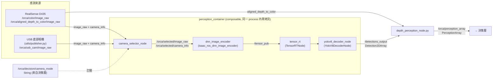
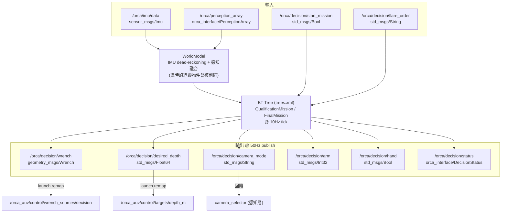

# Orca AUV 架構文件（Architecture）

本文件說明 SAUVC-JETSON 這個 ROS 2 workspace 的系統架構，依邏輯分層（感知、決策……）介紹各 package 的職責、node、topic 與訊息型別（message type）。環境安裝與啟動指令請參考 [README.md](README.md)，這份文件專注在「系統怎麼運作」。

假設讀者已具備 ROS 2 基礎（node / topic / QoS / composable node / launch 系統），不會重新介紹這些概念；但對 BehaviorTree.CPP、Isaac ROS 這類較小眾的框架，會補充其設計動機。

## 目錄

1. [專案總覽與硬體平台](#1-專案總覽與硬體平台)
2. [系統分層](#2-系統分層)
3. [感知層 Perception](#3-感知層-perception)
4. [決策層 Decision](#4-決策層-decision)
5. [訊息介面定義：orca_interface](#5-訊息介面定義orca_interface)
6. [感測器／飛控介面：mavros_config](#6-感測器飛控介面mavros_config)
7. [已移入 legacy 的東西](#7-已移入-legacy-的東西)
8. [開發／除錯工具：utils](#8-開發除錯工具utils)
9. [模型檔案：model/](#9-模型檔案model)
10. [已知問題與待清理事項](#10-已知問題與待清理事項)

---

## 1. 專案總覽與硬體平台

Orca 是參加 SAUVC（Singapore AUV Challenge）的水下機器人（AUV, Autonomous Underwater Vehicle）。本 repo 是跑在 **Jetson Orin NX + Isaac ROS 3.2** 上的自主系統（autonomy stack），涵蓋從相機輸入、物件偵測（object detection）與深度估計（depth estimation），到基於行為樹（Behavior Tree）的任務執行。

**不在此 repo 內的部分**：推進器分配（thruster allocation）與底層馬達控制，屬於下游模組（推測跑在飛控或 companion board 上），本文件只會標出交界的 topic。

## 2. 系統分層

```
感測層 Sensor          感知層 Perception         決策層 Decision          控制層 Control
─────────────         ──────────────           ──────────────          ──────────────
RealSense D435    ─┐                                                    (不在此 repo)
USB 底部攝影機      ┼→ camera_selector      →   decision_node        →  wrench_sources/decision
飛控 IMU (MAVROS)  ─┘   → YOLOv8 → depth_perception  (BehaviorTree.CPP)    targets/depth_m
                        → /orca/perception_array
```

| 層 | 對應 package | 角色 |
|---|---|---|
| 感測 | `mavros_config`, `utils/publisher.py` | IMU 讀取、底部相機餵入 |
| 感知 | `camera_selector`, `isaac_ros_yolov8`, `depth_perception`, `orca_perception` | 影像 → 2D 偵測 → 3D 定位 |
| 決策 | `orca_decision` | Behavior Tree 任務執行、輸出控制指令 |
| 介面定義 | `orca_interface` | 感知層與決策層共用的自訂訊息 |

---

## 3. 感知層 Perception

### 3.1 設計概念

感知層要解決的問題：把相機原始影像轉成決策層能用的「目標物件的 3D 位置＋信心程度」。中間分成三個子問題各自對應一個 package：
- **選擇影像來源**（RealSense 或 USB 底部相機）
- **2D 物件偵測**（YOLOv8 透過 TensorRT 加速推論）
- **2D → 3D 定位＋時間上的穩定度追蹤**（把單幀的偵測結果，結合深度圖與多幀濾波，變成可信賴的 3D 位置）

其中影像編碼（encoding）、TensorRT 推論、YOLOv8 解碼三步共用同一塊 GPU 記憶體，因此被放進同一個 **composable node container**（`perception_container`），透過零拷貝（zero-copy）的 NITROS（NVIDIA Isaac Transport for ROS）機制傳遞張量（tensor），避免跨 process 序列化的開銷——這是 Isaac ROS 生態系的核心設計動機。

### 3.2 感知層資料流



`camera_selector` 訂閱的 `/orca/decision/camera_mode` 是由決策層回饋控制（見第 4 節），代表決策層可以主動要求切換相機來源，形成一個小閉環。

### 3.3 逐 package 說明

#### `camera_selector`（C++，composable node）
即時在 RealSense 與 USB 底部攝影機之間切換影像來源。

| I/O | Topic | Message Type | 備註 |
|---|---|---|---|
| Sub | `/orca/color/image_raw`, `/orca/color/camera_info` | `sensor_msgs/Image`, `CameraInfo` | RealSense |
| Sub | `/orca/usb_cam/image_raw`, `/orca/usb_cam/camera_info` | `sensor_msgs/Image`, `CameraInfo` | USB 底部相機 |
| Sub | `/orca/decision/camera_mode` | `std_msgs/String` | reliable + transient_local QoS |
| Pub | `/orca/selected/image_raw`, `/orca/selected/camera_info` | `sensor_msgs/Image`, `CameraInfo` | 依 mode 轉發 |

邏輯很單純：依目前 mode 把對應來源的 image/camera_info 轉發到 `selected` topic，並對齊時間戳（timestamp）。

#### `isaac_ros_yolov8`（改自 NVIDIA 官方 isaac_ros_object_detection）
把 TensorRT 的張量輸出解碼成標準的 `vision_msgs/Detection2DArray`。

- Node：`YoloV8DecoderNode`（composable），輸出 `/detections_output`
- 可選視覺化 node：`isaac_ros_yolov8_visualizer.py` → `/yolov8_processed_image`
- 該 package 自帶的獨立 launch 檔已標註 deprecated，實際部署一律透過 `orca_perception` 以 ComposableNode 組裝進 `perception_container`。

#### `depth_perception`（Python）
感知層到決策層之間唯一的橋樑：把 2D 偵測框結合深度圖，換算成 3D 位置，並做多幀穩定度追蹤（filter 掉單幀雜訊造成的誤判）。

| I/O | Topic | Message Type |
|---|---|---|
| Sub | `/orca/aligned_depth_to_color/image_raw` | `sensor_msgs/Image`（best-effort QoS） |
| Sub | `/orca/color/camera_info` | `sensor_msgs/CameraInfo` |
| Sub | `/detections_output` | `vision_msgs/Detection2DArray`（reliable QoS） |
| Sub | `/orca/decision/camera_mode` | `std_msgs/String`（transient_local） |
| Pub | `/orca/perception_array` | `orca_interface/PerceptionArray` |

兩種模式：
- **RealSense 模式**：對閘門（gate）用左右對稱深度取樣，一般物件用中心裁切區域的百分位數深度，解算出 3D `pose`。
- **USB 模式**：只做 2D passthrough（`distance=-1`, `valid=False`），但穩定度追蹤器仍會運作（`is_stable`）。

另有 `depth_perception_viz_node.py`（debug 用視覺化疊圖，可選）。

#### `orca_perception`（統一 launcher，無自己的 node）
一個 launch 檔 + 一組 YAML，把上述元件串起來：

1. 建立 `perception_container`，放入 `camera_selector_node`、`tensor_rt`、`yolov8_decoder_node` 三個 composable node
2. `IncludeLaunchDescription` 引入 `isaac_ros_dnn_image_encoder` 的 launch，attach 到同一 container
3. 獨立 process 啟動 `depth_perception_node.py`（必要）與 viz node（`use_viz` 開關）
4. **`model_profiles` 機制**：依 `model_profile` 參數（`finals` / `qualification` / 模擬用）切換不同的 `.onnx` 模型路徑與類別數，讓實機與 Gazebo 模擬共用同一份 launch 邏輯，只換參數檔（`perception_params.yaml` vs `simulation_params.yaml`）。

啟動入口：`ros2 launch orca_perception perception.launch.py`

### 3.4 輸出訊息格式：`PerceptionArray`

感知層最終交給決策層的唯一資料結構，由 `depth_perception_node.py` 在每個處理週期組裝、發布到 `/orca/perception_array`。定義在 `orca_interface/msg/`（第 5 節有介面總覽，這裡補完每個欄位的來源與語意）。

**`PerceptionArray.msg`**

```
std_msgs/Header header
orca_interface/PerceptionObject[] objects
```

`header.stamp` 沿用觸發這次推論的影像幀時間戳，`objects` 是該幀所有通過 YOLO 信心門檻的偵測結果，一對一對應 `depth_perception` 內部算完深度後的物件列表——陣列長度隨每幀偵測數量變動，可能是空陣列（無偵測）。

**`PerceptionObject.msg`** 逐欄位說明：

| 欄位 | 型別 | 語意與計算來源 |
|---|---|---|
| `label` | `string` | 類別英文名，由 `class_id` 查 `class_names`（`perception_params.yaml` 的 `model_profiles.<profile>.class_names`）反查得到 |
| `confidence` | `float32` | YOLO 原始信心分數，範圍 `[0.0, 1.0]`，門檻由 `yolov8_decoder_node` 的 `confidence_threshold` 過濾 |
| `cx`, `cy`, `width`, `height` | `float32` | 2D bounding box 中心點與寬高，座標系是**送進 YOLO 網路前的輸入像素座標**（`yolo_input_width` × `yolo_input_height`，預設 640×640），不是原始相機解析度，換算回原圖需自行依縮放比例反推 |
| `pose` | `geometry_msgs/Pose` | 物件相對 AUV 的 3D 位置，**只有 RealSense 模式才有效**；`position = (X, Y, Z)`，公尺為單位，採相機座標系（camera frame）：X 向右、Y 向下、Z 向前；`orientation` 未解算時固定為單位四元數（identity quaternion），這個欄位目前不表示物件朝向 |
| `distance` | `float32` | 物件距離（公尺）。USB 模式或深度值不合理時固定為 `-1.0` |
| `valid` | `bool` | **單幀**深度合理性檢查結果（例如是否通過 `depth_min_range`、gate 對稱性等 `perception_params.yaml` 裡列的門檻），只反映這一幀 |
| `is_stable` | `bool` | **多幀**穩定度追蹤結果，需同時滿足：近 `stability_window` 幀內命中次數 ≥ `stability_min_hits`、位置標準差 < `stability_pos_std_thresh`、信心 ≥ `stability_conf_thresh`；決策層通常以 `is_stable` 而非單幀 `valid` 作為「可以鎖定這個目標」的判斷依據，避免單幀雜訊誤觸發行為樹動作 |

`valid` 與 `is_stable` 是兩層不同時間尺度的過濾器：前者篩掉「這一幀的深度讀數壞掉」，後者篩掉「目標時有時無、位置跳動」——決策層的 `WorldModel`（見 4.3 節）主要依賴後者來決定是否把這個物件當作可信賴的追蹤目標。

---

## 4. 決策層 Decision

### 4.1 設計概念：為什麼用 Behavior Tree

`orca_decision` 用 **BehaviorTree.CPP v3** 而非傳統的手刻有限狀態機（FSM, Finite State Machine）。行為樹（Behavior Tree）把任務拆成可重用、可組合的節點（Sequence／Fallback／Action／Condition），每個 tick 從樹根往下走訪，天生支援：
- **子任務重用**：像 `TargetAcquisition`、`PassGateProcedure` 這種子樹（subtree）可以在不同任務中被多處引用，不用像 FSM 一樣為每個組合重寫轉移邏輯。
- **失敗處理與重試**：Fallback 節點讓「先嘗試 A，失敗就退回 B」的邏輯不需要額外狀態變數。
- **宣告式（declarative）任務定義**：整個任務流程寫在 `config/trees.xml`，換賽制（資格賽 vs 決賽）只需換 XML，不用重新編譯。

### 4.2 decision_node 資料流



`/orca/decision/wrench` 內部先經過 `WrenchAdapter` 把 BT 節點算出的 `MotionCommand`（surge／sway／heave／yaw）做低通濾波（low-pass filter）平滑化，再轉成 `geometry_msgs/Wrench`。

### 4.3 核心元件（`include/orca_decision/`）

| 元件 | 職責 |
|---|---|
| `DecisionContext` | BT 節點共享的 blackboard，存放任務狀態、目標標籤、publisher 等 |
| `WorldModel` | 用 IMU 做 dead-reckoning，融合感知結果維護世界座標系下的追蹤物件（`TrackedObject`），超過 `perception_timeout_sec` 的物件會被剔除 |
| `WrenchAdapter` | 把 `MotionCommand` 轉成低通濾波後的 `Wrench` |

### 4.4 BT 節點與任務樹

`src/behavior_tree_nodes/` 底下共 20 個自訂 BT 節點，涵蓋搜尋（`SearchTarget`）、逼近（`ApproachTarget`）、避障（`AvoidObstacle`）、機械臂控制（`ExtendArm` / `GrabBall` / `RetractArm`）、深度／朝向控制（`SetDepth` / `TurnToYaw`）等。這些節點的非同步行為（如逼近目標的多 tick 過程）是靠 BT tick loop 搭配內部逾時（timeout）自行管理，**沒有使用 ROS 2 action server**。

`config/trees.xml` 定義兩個主任務樹：

```
FinalMission（main_tree_id 預設值）
├─ WaitForStart
├─ PassGateProcedure        （子樹：過閘門）
├─ TargetAcquisition        （子樹：目標搜尋與鎖定）
├─ ...（含避障、抓球、通訊旗語任務）
├─ TargetReacquisition      （子樹：目標遺失後重取得）
└─ FinishMission

QualificationMission
└─ 潛水 → 過閘門 → 迴轉 → 回程 → 浮出
```

啟動入口：`ros2 launch orca_decision autonomy.launch.py` —— 它同時拉起感知管線與決策節點。

**不要只跑 `decision.launch.py`。** 那個檔案只有行為樹，沒有任何節點發布 `/orca/perception_array`，
世界模型會永遠是空的：所有搜尋／接近節點跑到逾時，而 `ros2 node list` 與 `make status` 全都顯示健康。
它保留下來只是給「單獨除錯行為樹」用的（`autonomy.launch.py use_perception:=false` 是同樣的效果）。

---

## 5. 訊息介面定義：`orca_interface`

感知層與決策層之間唯一的自訂訊息定義，無 node。

**`PerceptionObject.msg`**

| 欄位 | 型別 | 說明 |
|---|---|---|
| `label` | `string` | 類別名稱 |
| `confidence` | `float32` | YOLO 信心分數 |
| `cx, cy, width, height` | `float32` | 2D bounding box（像素座標） |
| `pose` | `geometry_msgs/Pose` | 3D 位置（僅 RealSense 模式有效） |
| `distance` | `float32` | 深度距離，`-1.0` 代表未知 |
| `valid` | `bool` | 單幀深度是否合理 |
| `is_stable` | `bool` | 多幀穩定度追蹤結果 |

**`PerceptionArray.msg`**：`std_msgs/Header header` + `PerceptionObject[] objects`

**`DecisionStatus.msg`**：`header`, `mission_phase`, `current_action`, `target_label`, `target_position`, `target_locked`, `is_recovering`, `mission_time`, `camera_mode`, `debug`

---

## 6. 感測器／飛控介面：`mavros_config`

只有兩個 YAML，沒有 launch 檔、沒有 node 原始碼——MAVROS 被限縮成只讀取飛控（flight controller）的 **IMU** 資料，不用來下發推進器指令：

```yaml
plugin_blacklist: ['*']
plugin_allowlist: ['imu', 'sys_time', 'param']
```

推力分配（thruster allocation）與馬達控制不在此 repo 內，屬於下游／companion board 模組。

---

## 7. 已移入 `legacy` 的東西

`legacy/` 底下有一個空的 `COLCON_IGNORE`，整個子樹不會被編譯。原始碼保留在
git 裡供查閱，理由見 [legacy/README.md](legacy/README.md)。

| Package | 被誰取代 |
|---|---|
| `sauvc_sim` | 獨立的 `SAUVC-Simulation` repo（自己的容器與 Gazebo Fortress 場景） |
| `fsm_decision` | `orca_decision`（BehaviorTree.CPP） |

同批移除的還有 `realsense-ros` submodule（與 `Dockerfile.realsense` 裝進映像的
NVIDIA fork 重複，且從未初始化）與 `Dockerfile.orca`（已被 `Dockerfile.orca25`
取代）。

Isaac 映像本身也一併瘦身：`Dockerfile.orca25` 不再安裝 `ignition-fortress` 與
`ros-humble-ros-gz` —— 實機的 Isaac 容器永遠不會跑 Gazebo，而模擬有自己的容器。
這一層從 1.1 GB 降到 0.3 GB。

> **不要為了瘦身去改下層的 Dockerfile。** `build_image_layers.sh` 用
> 「Dockerfile 鏈的 md5」向 `nvcr.io/nvidia/isaac/ros` 查詢預先建好的映像；
> 改動 `Dockerfile.base` / `.aarch64` / `.ros2_humble` 會讓查詢失敗，
> Jetson 只能從頭 build 那 17.8 GB 的 base（含 bloom 編 MoveIt / rclcpp），
> 要好幾個小時 —— 砍 dependency 反而讓 build 大幅變慢。
> 專案自己的改動放最外層的 `Dockerfile.orca25`，不影響該 hash（已實測驗證）。
>
> 真正的解法是**不要在 Jetson 上 build**：用 x86 機器建好推 registry，
> Jetson 只 `pull`。見 `isaac_ros_common/scripts/orca_registry.sh`。

## 8. 開發／除錯工具：`utils`

非正式 package（無 `package.xml`），兩支獨立腳本：

- **`publisher.py`**（`BottomCamPublisher`）：把底部 USB camera 用 OpenCV 讀取後包成 `Image`/`CameraInfo`，發布到 `/orca/usb_cam/image_raw` 與 `/orca/usb_cam/camera_info`，對接 `camera_selector` 的 USB 輸入來源。實機測試時用來餵底部相機資料進 pipeline。
- **`depth_viewer.py`**（`DepthInspector`）：訂閱彩色/深度影像，用 OpenCV 顯示滑鼠位置的深度值，純除錯用。

---

## 9. 模型檔案：`model/`

直接 commit 進 repo 的 YOLOv8 權重（`.onnx` 格式），被 `orca_perception` 的 `model_profiles` 機制引用：

| 檔案 | 對應 profile | 類別數 | 用途 |
|---|---|---|---|
| `finals.onnx` | `finals`（預設） | 7 類 | 決賽用，含 `blue_drum, blue_flare, gate, orange_flare, red_drum, red_flare, yellow_flare` |
| `qualification.onnx` | `qualification` | 1 類 | 資格賽，只偵測 `gate` |
| `sim_best.onnx` | 模擬用 | — | 對應 `simulation_params.yaml` |
| `best_conti.onnx`, `best_pretrain.onnx` | 未被引用 | — | 推測是訓練過程中的 checkpoint |

---

## 10. 已知問題與待清理事項

- `perception_pipeline/depth_perception/msg/` 底下有一份重複但**未被實際使用**的 `PerceptionArray`/`PerceptionObject.msg`，程式碼實際 import 的是 `orca_interface` 那份定義，這份重複檔案可能是待清理的殘留。
- `model/best_conti.onnx`、`model/best_pretrain.onnx` 目前沒有被任何 launch config 引用，用途待確認。
